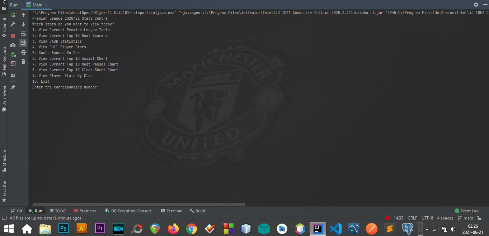
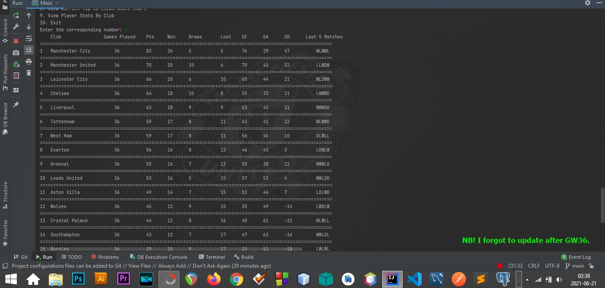
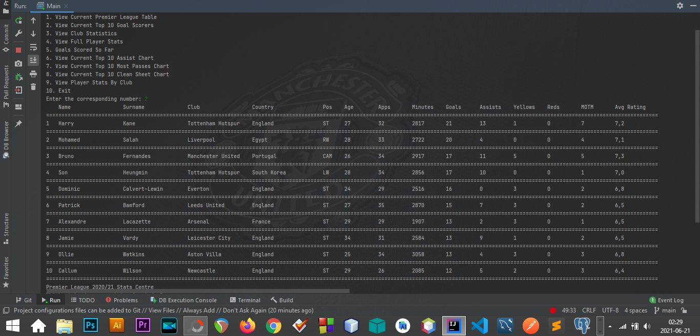
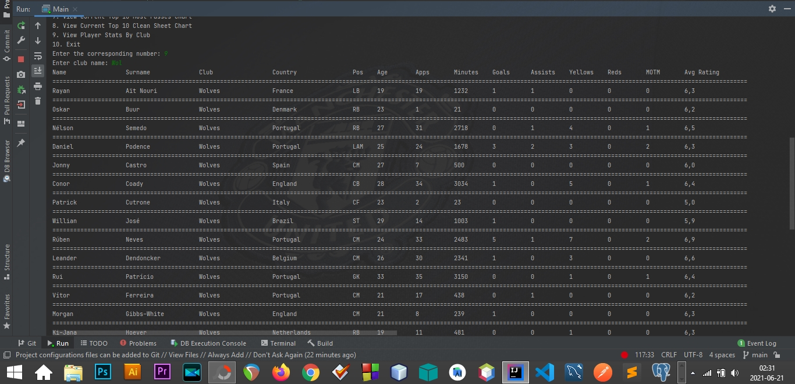
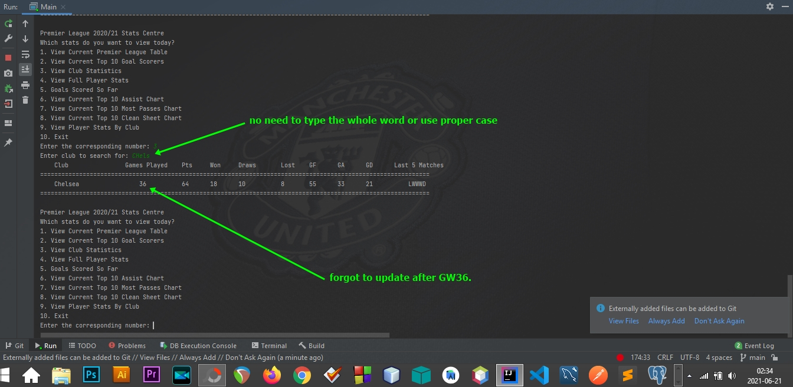

# Premier League Stats Center 2020/21

A Premier League console app that takes advantage of the Stream API as well as the Comparator Interface. Functionalities
include:

- Listing player seasons stats
- Searching for a club and showing its season stats.
- Searching for a club and showing the club's player stats.
- Listing the top goalscorers, assist makers and pass masters.
- Listing goal keeper stats

I plan to make a YouTube tutorial on how to do make this basic program as I believe it offers a fun way of learning
about streams, lambda and the comparator interface.

